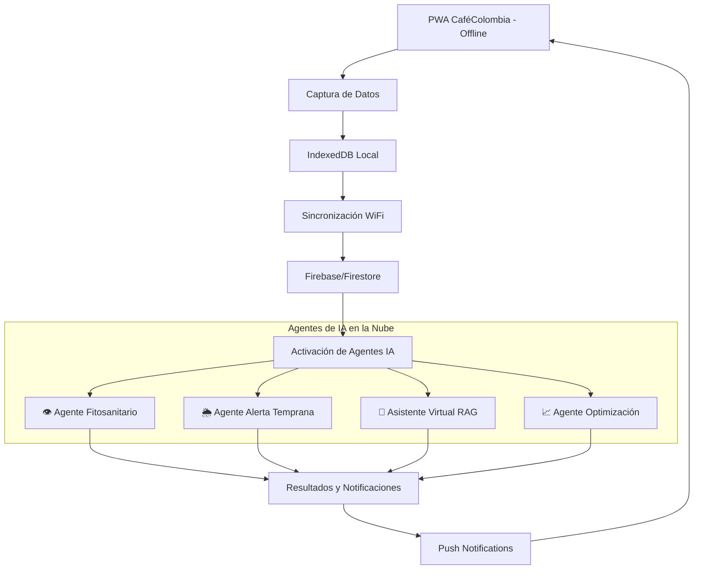
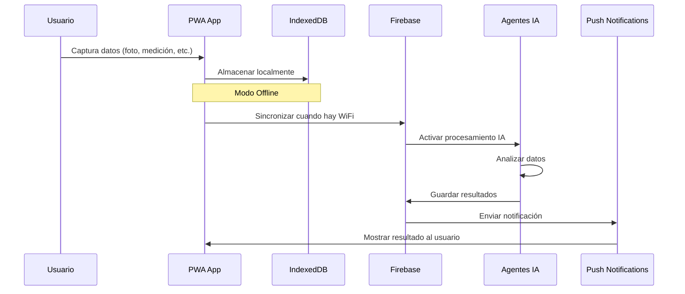

# Arquitectura Técnica: Integración de Agentes de IA - CaféColombia PWA

## 1. Visión General del Sistema

### 1.1 Arquitectura Híbrida Offline-First + Cloud AI

La integración de agentes de IA en CaféColombia mantiene la filosofía offline-first para la captura de datos, mientras aprovecha el poder de la nube para el procesamiento de IA. Esta arquitectura híbrida garantiza que los caficultores puedan trabajar sin conexión en el campo y recibir insights inteligentes cuando se sincronicen.



### 1.2 Principios de Diseño

- **Offline-First**: Captura de datos sin dependencia de conectividad
- **Cloud-Powered**: Procesamiento de IA en la nube para máximo rendimiento
- **Asíncrono**: Los agentes procesan datos cuando están disponibles
- **Contextual**: Resultados integrados con los datos existentes de la finca
- **Escalable**: Arquitectura que soporta miles de fincas simultáneamente

## 2. Agentes de IA Detallados

### 2.1 👁️ Agente Fitosanitario (Diagnóstico por Imagen)

#### Tecnología
- **Modelo**: Google Cloud Vertex AI Vision / AWS Rekognition Custom Labels
- **Entrenamiento**: Dataset de 10,000+ imágenes de café (roya, broca, mancha de hierro, deficiencias nutricionales)
- **Precisión objetivo**: >90% para las 8 plagas/enfermedades más comunes

#### Integración con Módulo MIP
```typescript
// Nuevo componente: DiagnosticoPorFoto.tsx
interface DiagnosticoResult {
  diagnosticos: Array<{
    enfermedad: string;
    confianza: number;
    descripcion: string;
    tratamientoRecomendado: string;
    insumosRelacionados: string[];
  }>;
  imagenAnalizada: string;
  timestamp: Date;
  loteId: string;
}
```

#### Flujo de Usuario
1. **Captura Offline**: Usuario toma foto en MIP → Diagnóstico por Foto
2. **Almacenamiento Local**: Imagen guardada en IndexedDB con metadatos del lote
3. **Sincronización**: Cuando hay WiFi, imagen se sube a Cloud Storage
4. **Procesamiento**: Cloud Function activa el modelo de visión por computadora
5. **Resultado**: Diagnóstico enviado como notificación push y guardado en la app

#### Implementación Técnica
```javascript
// Cloud Function: procesarDiagnosticoFitosanitario
exports.procesarDiagnosticoFitosanitario = functions.storage.object().onFinalize(async (object) => {
  const imageUri = `gs://${object.bucket}/${object.name}`;
  
  // Llamada a Vertex AI Vision
  const prediction = await vertexAI.predict({
    endpoint: 'projects/cafe-colombia/locations/us-central1/endpoints/fitosanitario-model',
    instances: [{ image: { gcsUri: imageUri } }]
  });
  
  // Procesar resultados y enviar notificación
  const diagnostico = procesarResultados(prediction);
  await enviarNotificacionDiagnostico(diagnostico);
});
```

### 2.2 🌦️ Agente de Alerta Temprana (Predictivo)

#### Tecnología
- **Modelo**: TensorFlow/PyTorch para series temporales
- **Datos de entrada**: API meteorológica + datos históricos FNC + datos de la finca
- **Frecuencia**: Análisis diario automatizado

#### Variables del Modelo
```typescript
interface DatosPrediccion {
  clima: {
    temperatura: number[];
    humedad: number[];
    precipitacion: number[];
    pronostico5Dias: WeatherForecast;
  };
  finca: {
    altitud: number;
    variedad: string;
    edadLote: number;
    historialPlagas: PlagaHistorial[];
  };
  contextoRegional: {
    brotesRecientes: BroteRegional[];
    alertasFNC: AlertaFNC[];
  };
}
```

#### Integración con Dashboard
- **Widget de Alertas**: Nuevo componente en el dashboard principal
- **Notificaciones Proactivas**: Push notifications 48-72h antes del riesgo
- **Calendario de Monitoreo**: Integración con módulo de labores

#### Implementación
```javascript
// Función programada diaria
exports.analizarRiesgosPlagas = functions.pubsub.schedule('0 6 * * *').onRun(async (context) => {
  const fincas = await obtenerTodasLasFincas();
  
  for (const finca of fincas) {
    const datosClima = await obtenerPronosticoClimatico(finca.ubicacion);
    const riesgo = await modeloPrediccion.predecir({
      clima: datosClima,
      finca: finca.caracteristicas,
      historial: finca.historialPlagas
    });
    
    if (riesgo.probabilidad > 0.7) {
      await enviarAlertaTemprana(finca.userId, riesgo);
    }
  }
});
```

### 2.3 💬 Asistente Virtual Cafetero (LLM-RAG)

#### Tecnología
- **LLM Base**: OpenAI GPT-4 / Google PaLM 2
- **RAG Database**: Vector database con documentos FNC, ICA, BPA Colombia
- **Embeddings**: OpenAI text-embedding-ada-002

#### Base de Conocimiento
```typescript
interface DocumentoRAG {
  id: string;
  tipo: 'FNC' | 'ICA' | 'BPA' | 'NORMATIVA';
  titulo: string;
  contenido: string;
  embedding: number[];
  fechaActualizacion: Date;
  relevancia: string[];
}
```

#### Integración en la App
- **Chat Flotante**: Botón de ayuda en todas las pantallas
- **Contexto Inteligente**: El asistente conoce los datos actuales de la finca
- **Respuestas Accionables**: Enlaces directos a módulos relevantes

#### Flujo de Consulta
```typescript
// Servicio de Chat RAG
class AsistenteCafetero {
  async responderConsulta(pregunta: string, contextoFinca: FincaContext): Promise<RespuestaRAG> {
    // 1. Generar embedding de la pregunta
    const embedding = await openai.embeddings.create({
      model: "text-embedding-ada-002",
      input: pregunta
    });
    
    // 2. Buscar documentos relevantes
    const documentosRelevantes = await buscarDocumentosRAG(embedding.data[0].embedding);
    
    // 3. Construir prompt con contexto
    const prompt = construirPromptRAG(pregunta, documentosRelevantes, contextoFinca);
    
    // 4. Generar respuesta
    const respuesta = await openai.chat.completions.create({
      model: "gpt-4",
      messages: [{ role: "user", content: prompt }]
    });
    
    return {
      respuesta: respuesta.choices[0].message.content,
      fuentes: documentosRelevantes,
      accionesRecomendadas: extraerAcciones(respuesta)
    };
  }
}
```

### 2.4 📈 Agente de Optimización (Calidad y Costos)

#### Tecnología
- **Análisis de Correlación**: Scikit-learn / TensorFlow
- **Detección de Anomalías**: Isolation Forest / DBSCAN
- **Análisis de Series Temporales**: Prophet / ARIMA

#### Métricas Analizadas
```typescript
interface MetricasOptimizacion {
  costos: {
    fertilizantes: CostoInsumo[];
    manoDeObra: CostoLabor[];
    tratamientos: CostoTratamiento[];
  };
  produccion: {
    kgPorHectarea: number;
    calidadTaza: number;
    tiemposProcesamiento: TiempoProceso[];
  };
  correlaciones: {
    costoVsProduccion: number;
    tratamientoVsCalidad: number;
    climaVsRendimiento: number;
  };
}
```

#### Tipos de Insights Generados
1. **Optimización de Costos**: Identificación de ineficiencias en uso de insumos
2. **Mejora de Calidad**: Correlaciones entre procesos y puntaje de taza
3. **Predicción de Rendimiento**: Estimaciones basadas en datos históricos
4. **Benchmarking**: Comparación con fincas similares (anonimizada)

## 3. Arquitectura de Datos

### 3.1 Flujo de Datos Offline → Cloud



### 3.2 Estructura de Datos para IA

```typescript
// Esquema extendido para soporte de IA
interface DatosIA {
  // Datos para Agente Fitosanitario
  imagenesAnalisis: {
    id: string;
    imagenUrl: string;
    loteId: string;
    timestamp: Date;
    diagnostico?: DiagnosticoIA;
    estadoProcesamiento: 'pendiente' | 'procesando' | 'completado' | 'error';
  }[];
  
  // Datos para Agente Predictivo
  datosAmbientales: {
    fecha: Date;
    temperatura: number;
    humedad: number;
    precipitacion: number;
    fuenteDatos: 'sensor' | 'api' | 'manual';
  }[];
  
  // Datos para Agente Optimización
  metricas: {
    periodo: string;
    costoTotal: number;
    produccionTotal: number;
    calidadPromedio: number;
    eficienciaCalculada: number;
  }[];
  
  // Historial de consultas RAG
  consultasAsistente: {
    pregunta: string;
    respuesta: string;
    timestamp: Date;
    satisfaccion?: number;
  }[];
}
```

## 4. Implementación por Fases

### Fase 1: Fundación (Mes 1-2)
- ✅ Configuración de infraestructura cloud (Firebase Functions, Cloud Storage)
- ✅ Implementación de sincronización mejorada
- ✅ Sistema de notificaciones push
- ✅ Base de datos vectorial para RAG

### Fase 2: Agente Fitosanitario (Mes 3-4)
- 🔄 Recolección y etiquetado de dataset de imágenes
- 🔄 Entrenamiento del modelo de visión por computadora
- 🔄 Integración en módulo MIP
- 🔄 Pruebas con caficultores piloto

### Fase 3: Agente Predictivo (Mes 5-6)
- 🔄 Integración con APIs meteorológicas
- 🔄 Desarrollo del modelo predictivo
- 🔄 Sistema de alertas tempranas
- 🔄 Dashboard de riesgos

### Fase 4: Asistente RAG (Mes 7-8)
- 🔄 Digitalización de documentos FNC/ICA
- 🔄 Implementación del sistema RAG
- 🔄 Interfaz de chat integrada
- 🔄 Entrenamiento con casos de uso reales

### Fase 5: Agente Optimización (Mes 9-10)
- 🔄 Algoritmos de análisis de correlación
- 🔄 Sistema de insights automáticos
- 🔄 Reportes de optimización
- 🔄 Benchmarking entre fincas

### Fase 6: Refinamiento (Mes 11-12)
- 🔄 Optimización de modelos basada en feedback
- 🔄 Mejoras de UX/UI
- 🔄 Escalabilidad y performance
- 🔄 Documentación y capacitación

## 5. Stack Tecnológico

### 5.1 Frontend (PWA)
- **Existente**: React + TypeScript + Vite + IndexedDB
- **Nuevos componentes**: 
  - `DiagnosticoPorFoto.tsx`
  - `AlertasTempranasWidget.tsx`
  - `ChatAsistente.tsx`
  - `InsightsOptimizacion.tsx`

### 5.2 Backend y Cloud
```yaml
Infraestructura:
  - Firebase Functions (Node.js/TypeScript)
  - Google Cloud Storage (imágenes)
  - Firestore (datos estructurados)
  - Cloud Pub/Sub (eventos)

IA y ML:
  - Google Cloud Vertex AI (visión por computadora)
  - OpenAI GPT-4 (LLM para RAG)
  - Pinecone/Weaviate (vector database)
  - TensorFlow.js (modelos predictivos)

APIs Externas:
  - OpenWeatherMap API (datos meteorológicos)
  - IDEAM API (datos climáticos Colombia)
  - Firebase Cloud Messaging (notificaciones)
```

### 5.3 Seguridad y Privacidad
- **Encriptación**: Todas las imágenes y datos sensibles encriptados
- **Anonimización**: Datos para benchmarking completamente anonimizados
- **GDPR Compliance**: Derecho al olvido y portabilidad de datos
- **Autenticación**: Firebase Auth con roles y permisos granulares

## 6. Estimación de Costos

### 6.1 Costos de Desarrollo (12 meses)
```
Desarrollo de Software:     $120,000 USD
Entrenamiento de Modelos:   $25,000 USD
Infraestructura Cloud:      $15,000 USD
Dataset y Etiquetado:       $20,000 USD
Testing y QA:               $18,000 USD
Total Desarrollo:           $198,000 USD
```

### 6.2 Costos Operacionales (por mes)
```
Google Cloud Platform:      $2,500 USD/mes
OpenAI API:                 $1,200 USD/mes
APIs Meteorológicas:        $300 USD/mes
Firebase (10,000 usuarios): $800 USD/mes
Total Operacional:          $4,800 USD/mes
```

### 6.3 ROI Estimado
- **Reducción de pérdidas por plagas**: 15-25%
- **Optimización de costos de insumos**: 10-20%
- **Mejora en calidad de café**: 5-15%
- **Tiempo ahorrado en diagnósticos**: 70%

## 7. Métricas de Éxito

### 7.1 KPIs Técnicos
- **Precisión del diagnóstico**: >90%
- **Tiempo de respuesta**: <30 segundos
- **Disponibilidad del sistema**: >99.5%
- **Satisfacción del usuario**: >4.5/5

### 7.2 KPIs de Negocio
- **Adopción de agentes IA**: >80% de usuarios activos
- **Reducción de pérdidas**: 20% promedio
- **Incremento en productividad**: 15% promedio
- **Retención de usuarios**: >95%

## 8. Consideraciones de Escalabilidad

### 8.1 Escalabilidad Técnica
- **Arquitectura serverless**: Auto-escalado basado en demanda
- **CDN global**: Distribución de contenido optimizada
- **Caching inteligente**: Redis para datos frecuentemente accedidos
- **Load balancing**: Distribución de carga automática

### 8.2 Escalabilidad de Negocio
- **Modelo freemium**: Funcionalidades básicas gratuitas, IA premium
- **API marketplace**: Licenciamiento de modelos a terceros
- **Expansión regional**: Adaptación a otros países cafeteros
- **Partnerships**: Integración con cooperativas y exportadores

## 9. Plan de Contingencia

### 9.1 Fallbacks Técnicos
- **Modo degradado**: Funcionalidad básica sin IA cuando cloud no disponible
- **Modelos locales**: Versiones simplificadas para diagnósticos offline
- **Múltiples proveedores**: Redundancia en servicios críticos
- **Backup automático**: Respaldo continuo de datos y modelos

### 9.2 Mitigación de Riesgos
- **Calidad de datos**: Validación continua y feedback loops
- **Bias en modelos**: Auditorías regulares y datasets diversos
- **Dependencia de terceros**: Contratos SLA y proveedores alternativos
- **Regulaciones**: Compliance proactivo con normativas emergentes

---

## Conclusión

La integración de estos 4 agentes de IA transformará CaféColombia de una herramienta de gestión a un asistente inteligente que potencia la productividad y rentabilidad de los caficultores colombianos. La arquitectura híbrida offline-first + cloud AI garantiza que la tecnología sea accesible incluso en zonas rurales con conectividad limitada, mientras proporciona insights de nivel mundial cuando la conexión está disponible.

Esta evolución posiciona a CaféColombia como la plataforma de agricultura inteligente líder en el sector cafetero, con potencial de expansión a otros cultivos y regiones.