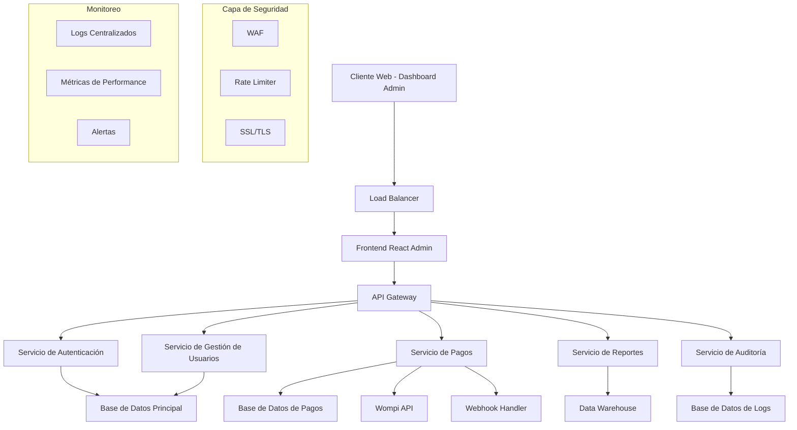
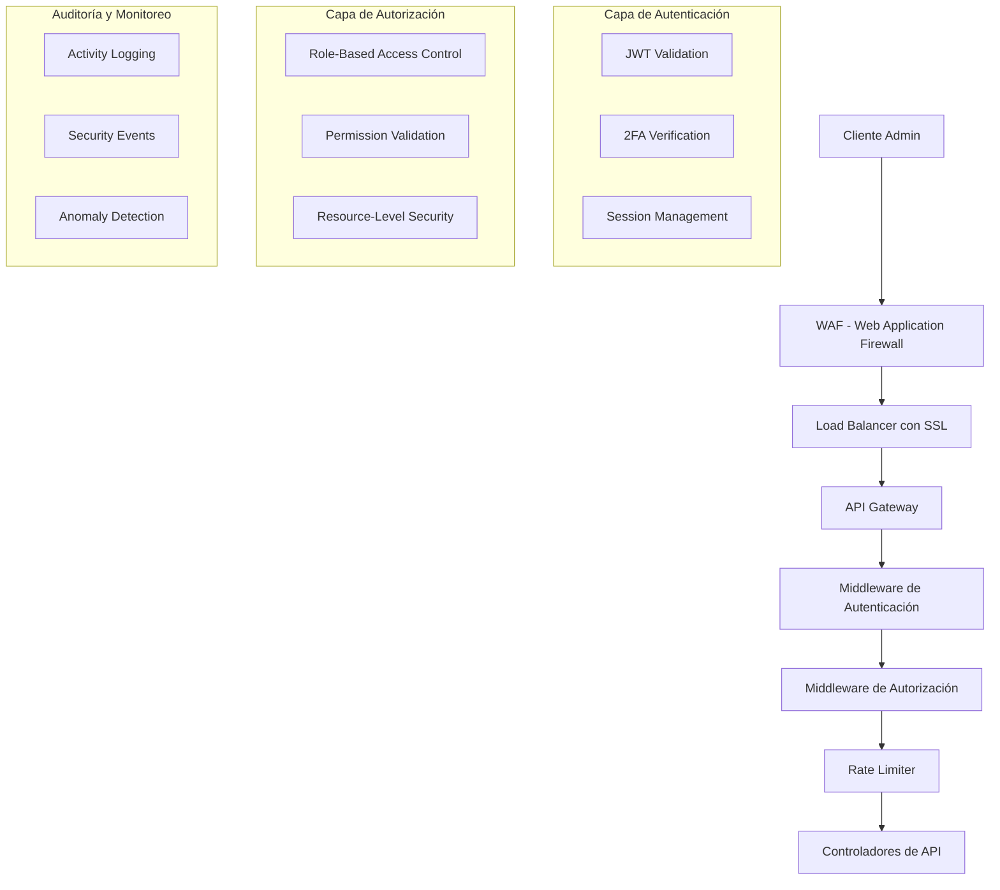
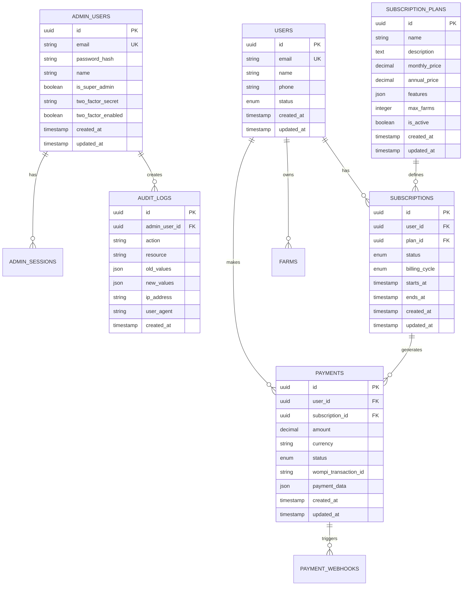
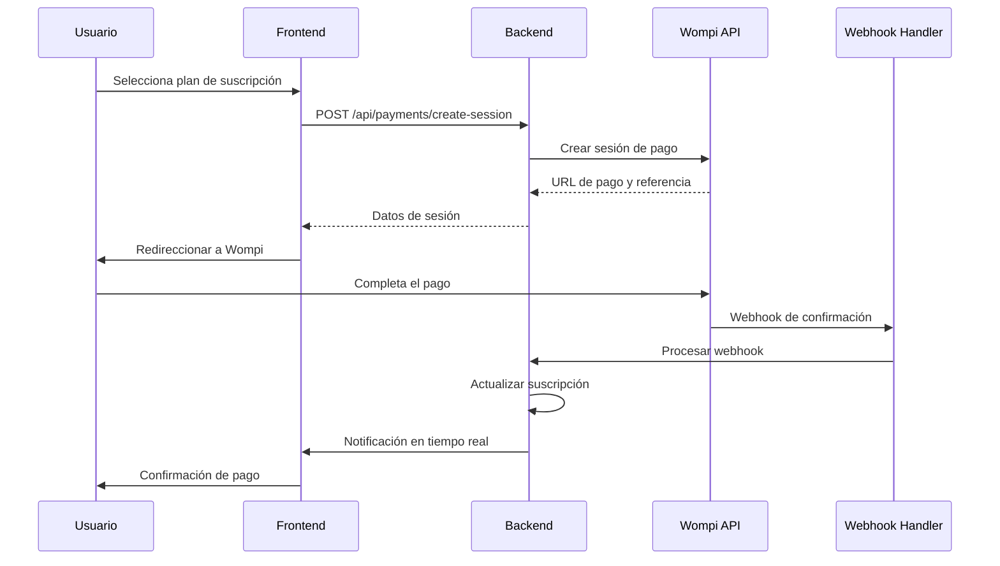
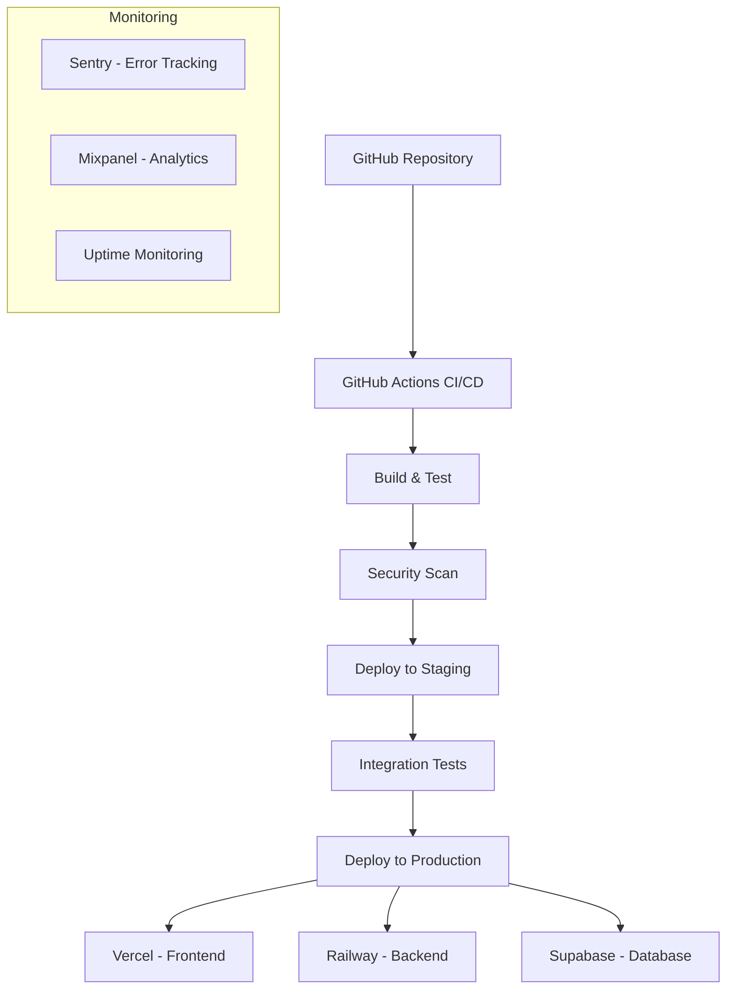
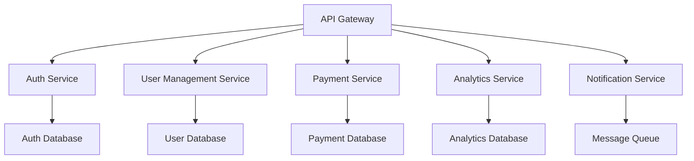

# Arquitectura Técnica - Panel de Superadministrador
## Café Colombia - Sistema de Gestión y Pagos

## 1. Arquitectura General del Sistema



## 2. Stack Tecnológico

### 2.1 Frontend
- **Framework:** React 18 + TypeScript
- **UI Library:** Tailwind CSS + Headless UI
- **Estado Global:** Zustand
- **Routing:** React Router v6
- **Formularios:** React Hook Form + Zod
- **Gráficos:** Chart.js + React-Chartjs-2
- **Tablas:** TanStack Table
- **Notificaciones:** React Hot Toast

### 2.2 Backend
- **Runtime:** Node.js 18+
- **Framework:** Express.js + TypeScript
- **Base de Datos:** Supabase (PostgreSQL)
- **ORM:** Prisma
- **Autenticación:** JWT + Supabase Auth
- **Validación:** Zod
- **Documentación API:** Swagger/OpenAPI

### 2.3 Servicios Externos
- **Pagos:** Wompi API
- **Email:** Supabase (Resend)
- **Storage:** Supabase Storage
- **Monitoreo:** Sentry
- **Analytics:** Mixpanel

## 3. Definición de Rutas

### 3.1 Rutas del Frontend Admin

| Ruta | Propósito | Protección |
|------|-----------|------------|
| `/admin` | Dashboard principal con métricas | SuperAdmin + 2FA |
| `/admin/login` | Página de login administrativo | Público |
| `/admin/users` | Gestión de usuarios del sistema | SuperAdmin |
| `/admin/farmers` | Gestión de caficultores | SuperAdmin |
| `/admin/farms` | Gestión de fincas | SuperAdmin |
| `/admin/subscriptions` | Gestión de suscripciones | SuperAdmin |
| `/admin/payments` | Historial y gestión de pagos | SuperAdmin |
| `/admin/plans` | Configuración de planes de pago | SuperAdmin |
| `/admin/reports` | Generación de reportes | SuperAdmin |
| `/admin/analytics` | Dashboard de analíticas avanzadas | SuperAdmin |
| `/admin/settings` | Configuración del sistema | SuperAdmin |
| `/admin/security` | Gestión de seguridad y permisos | SuperAdmin |
| `/admin/audit` | Registro de actividades | SuperAdmin |
| `/admin/profile` | Perfil del administrador | SuperAdmin |

### 3.2 Rutas de la Aplicación Principal (Mantenidas)

| Ruta | Propósito | Protección |
|------|-----------|------------|
| `/` | Página principal de la app | Público |
| `/login` | Login de usuarios regulares | Público |
| `/register` | Registro de nuevos usuarios | Público |
| `/dashboard` | Dashboard del caficultor | Autenticado |
| `/finca` | Gestión de fincas del usuario | Autenticado |
| `/mip` | Manejo Integrado de Plagas | Autenticado |
| `/insumos` | Gestión de insumos | Autenticado |
| `/traceability` | Trazabilidad del café | Autenticado |
| `/subscription` | Gestión de suscripción del usuario | Autenticado |
| `/payment/success` | Confirmación de pago exitoso | Autenticado |
| `/payment/cancel` | Cancelación de pago | Autenticado |

## 4. Definiciones de API

### 4.1 APIs de Autenticación y Autorización

**Autenticación de Superadministrador**
```
POST /api/admin/auth/login
```

Request:
| Parámetro | Tipo | Requerido | Descripción |
|-----------|------|-----------|-------------|
| email | string | true | Email del superadministrador |
| password | string | true | Contraseña |
| totpCode | string | true | Código 2FA |

Response:
| Parámetro | Tipo | Descripción |
|-----------|------|-------------|
| success | boolean | Estado de la autenticación |
| token | string | JWT token de acceso |
| refreshToken | string | Token para renovación |
| user | object | Datos del administrador |

**Verificación de Permisos**
```
GET /api/admin/auth/verify
```

Response:
| Parámetro | Tipo | Descripción |
|-----------|------|-------------|
| valid | boolean | Token válido |
| permissions | array | Lista de permisos |
| expiresAt | string | Fecha de expiración |

### 4.2 APIs de Gestión de Usuarios

**Listar Usuarios**
```
GET /api/admin/users
```

Query Parameters:
| Parámetro | Tipo | Descripción |
|-----------|------|-------------|
| page | number | Número de página |
| limit | number | Elementos por página |
| search | string | Búsqueda por nombre/email |
| status | string | Filtro por estado |
| plan | string | Filtro por plan de suscripción |

**Actualizar Usuario**
```
PUT /api/admin/users/:id
```

Request:
| Parámetro | Tipo | Descripción |
|-----------|------|-------------|
| name | string | Nombre del usuario |
| email | string | Email del usuario |
| status | string | Estado (active, suspended, banned) |
| plan | string | Plan de suscripción |

### 4.3 APIs de Gestión de Suscripciones

**Crear Plan de Suscripción**
```
POST /api/admin/subscription-plans
```

Request:
| Parámetro | Tipo | Requerido | Descripción |
|-----------|------|-----------|-------------|
| name | string | true | Nombre del plan |
| description | string | true | Descripción del plan |
| monthlyPrice | number | true | Precio mensual en COP |
| annualPrice | number | true | Precio anual en COP |
| features | array | true | Lista de características |
| maxFarms | number | true | Máximo número de fincas |
| isActive | boolean | true | Estado del plan |

**Procesar Pago**
```
POST /api/admin/payments/process
```

Request:
| Parámetro | Tipo | Requerido | Descripción |
|-----------|------|-----------|-------------|
| userId | string | true | ID del usuario |
| planId | string | true | ID del plan |
| billingCycle | string | true | monthly o annual |
| paymentMethod | object | true | Datos del método de pago |

### 4.4 APIs de Reportes y Analíticas

**Métricas del Dashboard**
```
GET /api/admin/analytics/dashboard
```

Response:
| Parámetro | Tipo | Descripción |
|-----------|------|-------------|
| totalUsers | number | Total de usuarios registrados |
| activeUsers | number | Usuarios activos en el mes |
| totalRevenue | number | Ingresos totales |
| monthlyRevenue | number | Ingresos del mes actual |
| subscriptions | object | Desglose de suscripciones por plan |
| churnRate | number | Tasa de cancelación |

**Generar Reporte**
```
POST /api/admin/reports/generate
```

Request:
| Parámetro | Tipo | Requerido | Descripción |
|-----------|------|-----------|-------------|
| type | string | true | Tipo de reporte (users, revenue, usage) |
| dateFrom | string | true | Fecha de inicio |
| dateTo | string | true | Fecha de fin |
| format | string | true | Formato (pdf, csv, json) |
| filters | object | false | Filtros adicionales |

## 5. Arquitectura de Seguridad

### 5.1 Diagrama de Seguridad



### 5.2 Implementación de Seguridad

**Autenticación Multi-Factor (2FA)**
```typescript
// Configuración 2FA
interface TwoFactorConfig {
  secret: string;
  qrCode: string;
  backupCodes: string[];
  isEnabled: boolean;
}

// Verificación 2FA
const verify2FA = (token: string, secret: string): boolean => {
  return authenticator.verify({ token, secret });
};
```

**Control de Acceso Basado en Roles (RBAC)**
```typescript
interface Permission {
  resource: string;
  action: string;
  conditions?: Record<string, any>;
}

interface Role {
  id: string;
  name: string;
  permissions: Permission[];
}

const checkPermission = (
  userRole: Role,
  resource: string,
  action: string
): boolean => {
  return userRole.permissions.some(
    p => p.resource === resource && p.action === action
  );
};
```

## 6. Modelo de Datos

### 6.1 Diagrama de Entidad-Relación



### 6.2 Definiciones de Esquema (DDL)

**Tabla de Administradores**
```sql
-- Tabla de usuarios administradores
CREATE TABLE admin_users (
    id UUID PRIMARY KEY DEFAULT gen_random_uuid(),
    email VARCHAR(255) UNIQUE NOT NULL,
    password_hash VARCHAR(255) NOT NULL,
    name VARCHAR(100) NOT NULL,
    is_super_admin BOOLEAN DEFAULT false,
    two_factor_secret VARCHAR(32),
    two_factor_enabled BOOLEAN DEFAULT false,
    last_login_at TIMESTAMP WITH TIME ZONE,
    created_at TIMESTAMP WITH TIME ZONE DEFAULT NOW(),
    updated_at TIMESTAMP WITH TIME ZONE DEFAULT NOW()
);

-- Índices para optimización
CREATE INDEX idx_admin_users_email ON admin_users(email);
CREATE INDEX idx_admin_users_super_admin ON admin_users(is_super_admin);
```

**Tabla de Planes de Suscripción**
```sql
-- Tabla de planes de suscripción
CREATE TABLE subscription_plans (
    id UUID PRIMARY KEY DEFAULT gen_random_uuid(),
    name VARCHAR(100) NOT NULL,
    description TEXT,
    monthly_price DECIMAL(10,2) NOT NULL,
    annual_price DECIMAL(10,2) NOT NULL,
    features JSONB NOT NULL DEFAULT '[]',
    max_farms INTEGER NOT NULL DEFAULT 1,
    is_active BOOLEAN DEFAULT true,
    created_at TIMESTAMP WITH TIME ZONE DEFAULT NOW(),
    updated_at TIMESTAMP WITH TIME ZONE DEFAULT NOW()
);

-- Datos iniciales de planes
INSERT INTO subscription_plans (name, description, monthly_price, annual_price, features, max_farms) VALUES
('Básico', 'Plan gratuito con funcionalidades limitadas', 0, 0, '["basic_analytics", "1_farm_max"]', 1),
('Premium', 'Plan completo para caficultores individuales', 29900, 299000, '["advanced_analytics", "unlimited_farms", "ai_recommendations", "priority_support"]', 999),
('Empresarial', 'Plan para empresas con múltiples usuarios', 59900, 599000, '["all_premium_features", "multi_user", "custom_reports", "api_access"]', 9999);
```

**Tabla de Suscripciones**
```sql
-- Tabla de suscripciones de usuarios
CREATE TABLE subscriptions (
    id UUID PRIMARY KEY DEFAULT gen_random_uuid(),
    user_id UUID NOT NULL REFERENCES auth.users(id) ON DELETE CASCADE,
    plan_id UUID NOT NULL REFERENCES subscription_plans(id),
    status VARCHAR(20) NOT NULL CHECK (status IN ('active', 'cancelled', 'expired', 'pending')),
    billing_cycle VARCHAR(10) NOT NULL CHECK (billing_cycle IN ('monthly', 'annual')),
    starts_at TIMESTAMP WITH TIME ZONE NOT NULL,
    ends_at TIMESTAMP WITH TIME ZONE NOT NULL,
    auto_renew BOOLEAN DEFAULT true,
    created_at TIMESTAMP WITH TIME ZONE DEFAULT NOW(),
    updated_at TIMESTAMP WITH TIME ZONE DEFAULT NOW()
);

-- Índices para optimización
CREATE INDEX idx_subscriptions_user_id ON subscriptions(user_id);
CREATE INDEX idx_subscriptions_status ON subscriptions(status);
CREATE INDEX idx_subscriptions_ends_at ON subscriptions(ends_at);
```

**Tabla de Pagos**
```sql
-- Tabla de pagos y transacciones
CREATE TABLE payments (
    id UUID PRIMARY KEY DEFAULT gen_random_uuid(),
    user_id UUID NOT NULL REFERENCES auth.users(id),
    subscription_id UUID REFERENCES subscriptions(id),
    amount DECIMAL(10,2) NOT NULL,
    currency VARCHAR(3) DEFAULT 'COP',
    status VARCHAR(20) NOT NULL CHECK (status IN ('pending', 'completed', 'failed', 'refunded')),
    wompi_transaction_id VARCHAR(100),
    wompi_reference VARCHAR(100),
    payment_method JSONB,
    payment_data JSONB,
    processed_at TIMESTAMP WITH TIME ZONE,
    created_at TIMESTAMP WITH TIME ZONE DEFAULT NOW(),
    updated_at TIMESTAMP WITH TIME ZONE DEFAULT NOW()
);

-- Índices para optimización
CREATE INDEX idx_payments_user_id ON payments(user_id);
CREATE INDEX idx_payments_status ON payments(status);
CREATE INDEX idx_payments_wompi_transaction_id ON payments(wompi_transaction_id);
CREATE INDEX idx_payments_created_at ON payments(created_at DESC);
```

**Tabla de Auditoría**
```sql
-- Tabla de logs de auditoría
CREATE TABLE audit_logs (
    id UUID PRIMARY KEY DEFAULT gen_random_uuid(),
    admin_user_id UUID REFERENCES admin_users(id),
    action VARCHAR(100) NOT NULL,
    resource VARCHAR(100) NOT NULL,
    resource_id UUID,
    old_values JSONB,
    new_values JSONB,
    ip_address INET,
    user_agent TEXT,
    created_at TIMESTAMP WITH TIME ZONE DEFAULT NOW()
);

-- Índices para optimización
CREATE INDEX idx_audit_logs_admin_user_id ON audit_logs(admin_user_id);
CREATE INDEX idx_audit_logs_action ON audit_logs(action);
CREATE INDEX idx_audit_logs_resource ON audit_logs(resource);
CREATE INDEX idx_audit_logs_created_at ON audit_logs(created_at DESC);
```

## 7. Integración con Wompi

### 7.1 Arquitectura de Pagos



### 7.2 Configuración de Wompi

**Inicialización del Cliente Wompi**
```typescript
interface WompiConfig {
  publicKey: string;
  privateKey: string;
  environment: 'sandbox' | 'production';
  webhookSecret: string;
}

class WompiService {
  private config: WompiConfig;
  
  constructor(config: WompiConfig) {
    this.config = config;
  }
  
  async createPaymentSession(data: PaymentSessionData) {
    const response = await fetch('https://api.wompi.co/v1/payment_sessions', {
      method: 'POST',
      headers: {
        'Authorization': `Bearer ${this.config.privateKey}`,
        'Content-Type': 'application/json'
      },
      body: JSON.stringify(data)
    });
    
    return response.json();
  }
}
```

**Manejo de Webhooks**
```typescript
interface WompiWebhook {
  event: string;
  data: {
    transaction: {
      id: string;
      status: string;
      reference: string;
      amount_in_cents: number;
    };
  };
  sent_at: string;
}

const handleWompiWebhook = async (webhook: WompiWebhook) => {
  // Verificar firma del webhook
  const isValid = verifyWebhookSignature(webhook);
  if (!isValid) throw new Error('Invalid webhook signature');
  
  // Procesar según el evento
  switch (webhook.event) {
    case 'transaction.updated':
      await processTransactionUpdate(webhook.data.transaction);
      break;
    default:
      console.log(`Unhandled webhook event: ${webhook.event}`);
  }
};
```

## 8. Estrategia de Testing

### 8.1 Tipos de Pruebas

**Pruebas Unitarias**
- Componentes React individuales
- Funciones de utilidad
- Servicios de API
- Validaciones de formularios

**Pruebas de Integración**
- Flujos de autenticación
- Procesamiento de pagos
- Webhooks de Wompi
- Operaciones CRUD

**Pruebas End-to-End**
- Flujo completo de suscripción
- Gestión de usuarios desde el admin
- Generación de reportes
- Funcionalidades críticas de seguridad

### 8.2 Herramientas de Testing

```typescript
// Jest + React Testing Library para componentes
import { render, screen, fireEvent } from '@testing-library/react';
import { AdminDashboard } from '../AdminDashboard';

test('should display user metrics', () => {
  render(<AdminDashboard />);
  expect(screen.getByText('Total Users')).toBeInTheDocument();
});

// Supertest para APIs
import request from 'supertest';
import { app } from '../app';

test('POST /api/admin/users should create user', async () => {
  const response = await request(app)
    .post('/api/admin/users')
    .send({ name: 'Test User', email: 'test@example.com' })
    .expect(201);
    
  expect(response.body.user.name).toBe('Test User');
});

// Playwright para E2E
import { test, expect } from '@playwright/test';

test('admin can create subscription plan', async ({ page }) => {
  await page.goto('/admin/plans');
  await page.click('[data-testid="create-plan-button"]');
  await page.fill('[name="name"]', 'Test Plan');
  await page.fill('[name="monthlyPrice"]', '29900');
  await page.click('[type="submit"]');
  
  await expect(page.locator('text=Test Plan')).toBeVisible();
});
```

## 9. Monitoreo y Observabilidad

### 9.1 Métricas de Sistema

**Métricas de Performance**
- Tiempo de respuesta de APIs
- Throughput de requests
- Uso de CPU y memoria
- Latencia de base de datos

**Métricas de Negocio**
- Conversiones de pago
- Tasa de error en transacciones
- Tiempo de activación de suscripciones
- Retención de usuarios

### 9.2 Alertas y Notificaciones

```typescript
interface AlertConfig {
  metric: string;
  threshold: number;
  operator: 'gt' | 'lt' | 'eq';
  duration: string;
  channels: ('email' | 'slack' | 'sms')[];
}

const alerts: AlertConfig[] = [
  {
    metric: 'api_response_time',
    threshold: 1000,
    operator: 'gt',
    duration: '5m',
    channels: ['email', 'slack']
  },
  {
    metric: 'payment_failure_rate',
    threshold: 5,
    operator: 'gt',
    duration: '1m',
    channels: ['email', 'sms']
  }
];
```

## 10. Despliegue y DevOps

### 10.1 Arquitectura de Despliegue



### 10.2 Variables de Entorno

```bash
# Configuración de Base de Datos
DATABASE_URL=postgresql://...
SUPABASE_URL=https://...
SUPABASE_ANON_KEY=...
SUPABASE_SERVICE_ROLE_KEY=...

# Configuración de Wompi
WOMPI_PUBLIC_KEY=pub_test_...
WOMPI_PRIVATE_KEY=prv_test_...
WOMPI_WEBHOOK_SECRET=...
WOMPI_ENVIRONMENT=sandbox

# Configuración de Seguridad
JWT_SECRET=...
ENCRYPTION_KEY=...
ADMIN_2FA_ISSUER=CafeColombiaAdmin

# Configuración de Monitoreo
SENTRY_DSN=...
MIXPANEL_TOKEN=...

# Configuración de Email
RESEND_API_KEY=...
```

### 10.3 Scripts de Despliegue

```json
{
  "scripts": {
    "build": "npm run build:frontend && npm run build:backend",
    "build:frontend": "cd frontend && npm run build",
    "build:backend": "cd backend && npm run build",
    "test": "npm run test:unit && npm run test:integration",
    "test:unit": "jest",
    "test:integration": "jest --config jest.integration.config.js",
    "test:e2e": "playwright test",
    "deploy:staging": "npm run build && npm run test && vercel --env=staging",
    "deploy:production": "npm run build && npm run test && vercel --prod",
    "db:migrate": "prisma migrate deploy",
    "db:seed": "prisma db seed"
  }
}
```

## 11. Consideraciones de Escalabilidad

### 11.1 Optimizaciones de Performance

**Caching Strategy**
- Redis para sesiones de usuario
- CDN para assets estáticos
- Query caching para reportes
- Memoización en componentes React

**Database Optimization**
- Índices optimizados para consultas frecuentes
- Particionamiento de tablas grandes (audit_logs)
- Read replicas para reportes
- Connection pooling

### 11.2 Arquitectura de Microservicios (Futuro)



Esta arquitectura permite escalabilidad horizontal y mantenimiento independiente de cada servicio según las necesidades del negocio.