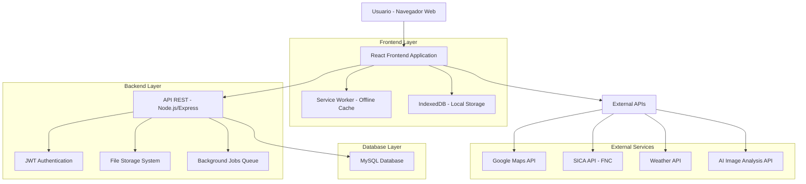
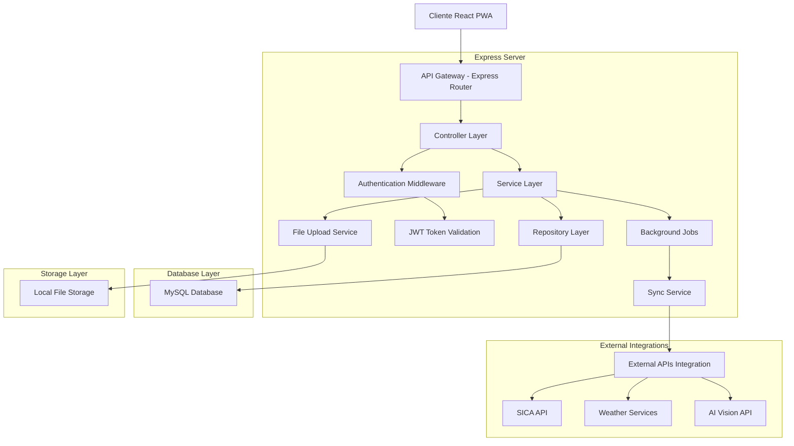
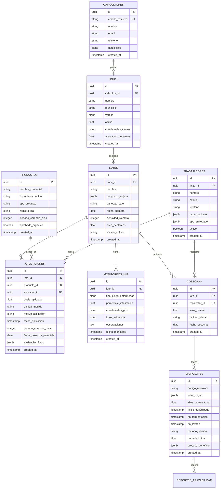

# Documento de Arquitectura Técnica - CaféColombia App

## 1. Diseño de Arquitectura



## 2. Descripción de Tecnologías

- **Frontend**: React@18 + TypeScript + Tailwind CSS@3 + Vite + PWA
- **Backend**: Node.js@18 + Express@4 + TypeScript
- **Base de Datos**: MySQL@8.0 + Prisma ORM
- **Autenticación**: JWT + bcrypt para hash de contraseñas
- **Mapas**: Google Maps API + Leaflet para funcionalidades offline
- **Offline**: Service Workers + IndexedDB + Background Sync
- **Integraciones**: SICA API (FNC) + Weather APIs + AI Vision APIs

## 3. Definiciones de Rutas

| Ruta | Propósito |
|------|-----------|
| / | Dashboard principal con resumen de la finca y alertas |
| /login | Página de autenticación con validación SICA |
| /register | Registro de nuevos caficultores con cédula cafetera |
| /finca | Gestión de la finca con mapa interactivo de lotes |
| /finca/lote/:id | Detalles específicos de un lote individual |
| /planificacion | Calendario de labores agrícolas y asignación de tareas |
| /insumos | Control de inventario y registro de aplicaciones |
| /insumos/aplicacion | Formulario para registrar aplicación de agroquímicos |
| /mip | Manejo Integrado de Plagas - monitoreo y control |
| /cosecha | Registro de cosecha y proceso de beneficio |
| /cosecha/microlote/:id | Gestión específica de microlotes |
| /trazabilidad | Generación de reportes y certificados |
| /trazabilidad/reporte/:tipo | Reportes específicos (BPA, sostenibilidad, etc.) |
| /financiero | Gestión financiera y control de costos |
| /personal | Gestión de trabajadores y registro de capacitaciones |
| /configuracion | Configuración de la finca y perfil del usuario |
| /offline | Página de estado offline con datos sincronizables |

## 4. Definiciones de API

### 4.1 APIs Principales

**Autenticación y Usuarios**
```
POST /auth/login
```

Request:
| Parámetro | Tipo | Requerido | Descripción |
|-----------|------|-----------|-------------|
| cedula_cafetera | string | true | Cédula cafetera del FNC |
| password | string | true | Contraseña del usuario |
| sica_validation | boolean | false | Validar contra SICA |

Response:
| Parámetro | Tipo | Descripción |
|-----------|------|-------------|
| access_token | string | Token JWT para autenticación |
| user | object | Datos del usuario y finca |
| sica_data | object | Información validada del SICA |

**Gestión de Lotes**
```
POST /api/lotes
GET /api/lotes
PUT /api/lotes/:id
```

Request (POST):
```json
{
  "nombre": "Lote La Esperanza",
  "poligono_geojson": {...},
  "variedad_cafe": "Castillo",
  "fecha_siembra": "2023-01-15",
  "densidad_siembra": 5500,
  "area_hectareas": 2.5,
  "estado_cultivo": "produccion"
}
```

**Registro de Aplicaciones de Insumos**
```
POST /api/aplicaciones
```

Request:
| Parámetro | Tipo | Requerido | Descripción |
|-----------|------|-----------|-------------|
| lote_id | uuid | true | ID del lote donde se aplicó |
| producto_id | uuid | true | ID del producto aplicado |
| dosis_aplicada | number | true | Cantidad aplicada en kg/ha o L/ha |
| motivo_aplicacion | string | true | Razón de la aplicación (plaga, enfermedad, etc.) |
| fecha_aplicacion | datetime | true | Fecha y hora de aplicación |
| aplicador_id | uuid | true | ID del trabajador que aplicó |
| periodo_carencia_dias | number | true | Días de carencia calculados |

**Monitoreo MIP**
```
POST /api/mip/monitoreo
```

Request:
```json
{
  "lote_id": "uuid",
  "tipo_monitoreo": "broca",
  "porcentaje_infestacion": 1.5,
  "fotos_evidencia": ["url1", "url2"],
  "coordenadas_gps": {"lat": 4.5709, "lng": -74.2973},
  "observaciones": "Focos localizados en zona alta del lote",
  "fecha_monitoreo": "2024-01-15T10:30:00Z"
}
```

**Generación de Reportes**
```
GET /api/reportes/trazabilidad/:microlote_id
GET /api/reportes/bpa/:finca_id
POST /api/reportes/exportar
```

## 5. Diagrama de Arquitectura del Servidor



## 6. Modelo de Datos

### 6.1 Diagrama de Entidad-Relación



### 6.2 Definición de Lenguaje de Datos (DDL) - MySQL

**Tabla de Caficultores**
```sql
-- Crear tabla de caficultores
CREATE TABLE caficultores (
    id CHAR(36) PRIMARY KEY DEFAULT (UUID()),
    cedula_cafetera VARCHAR(20) UNIQUE NOT NULL,
    nombre VARCHAR(100) NOT NULL,
    email VARCHAR(255) UNIQUE NOT NULL,
    password_hash VARCHAR(255) NOT NULL,
    telefono VARCHAR(20),
    datos_sica JSON,
    created_at TIMESTAMP DEFAULT CURRENT_TIMESTAMP,
    updated_at TIMESTAMP DEFAULT CURRENT_TIMESTAMP ON UPDATE CURRENT_TIMESTAMP
);

-- Crear índices
CREATE INDEX idx_caficultores_cedula ON caficultores(cedula_cafetera);
CREATE INDEX idx_caficultores_email ON caficultores(email);
```

**Tabla de Fincas**
```sql
-- Crear tabla de fincas
CREATE TABLE fincas (
    id CHAR(36) PRIMARY KEY DEFAULT (UUID()),
    caficultor_id CHAR(36) NOT NULL,
    nombre VARCHAR(100) NOT NULL,
    municipio VARCHAR(100) NOT NULL,
    vereda VARCHAR(100),
    altitud FLOAT,
    coordenadas_centro JSON,
    area_total_hectareas FLOAT,
    created_at TIMESTAMP DEFAULT CURRENT_TIMESTAMP,
    updated_at TIMESTAMP DEFAULT CURRENT_TIMESTAMP ON UPDATE CURRENT_TIMESTAMP,
    FOREIGN KEY (caficultor_id) REFERENCES caficultores(id) ON DELETE CASCADE
);

-- Crear índices
CREATE INDEX idx_fincas_caficultor ON fincas(caficultor_id);
CREATE INDEX idx_fincas_municipio ON fincas(municipio);
```

**Tabla de Lotes**
```sql
-- Crear tabla de lotes
CREATE TABLE lotes (
    id CHAR(36) PRIMARY KEY DEFAULT (UUID()),
    finca_id CHAR(36) NOT NULL,
    nombre VARCHAR(100) NOT NULL,
    poligono_geojson JSON NOT NULL,
    variedad_cafe VARCHAR(50) NOT NULL,
    fecha_siembra DATE NOT NULL,
    densidad_siembra INTEGER,
    area_hectareas FLOAT NOT NULL,
    estado_cultivo ENUM('crecimiento', 'produccion', 'zoca', 'renovacion') NOT NULL,
    created_at TIMESTAMP DEFAULT CURRENT_TIMESTAMP,
    updated_at TIMESTAMP DEFAULT CURRENT_TIMESTAMP ON UPDATE CURRENT_TIMESTAMP,
    FOREIGN KEY (finca_id) REFERENCES fincas(id) ON DELETE CASCADE
);

-- Crear índices
CREATE INDEX idx_lotes_finca ON lotes(finca_id);
CREATE INDEX idx_lotes_variedad ON lotes(variedad_cafe);
CREATE INDEX idx_lotes_estado ON lotes(estado_cultivo);
```

**Tabla de Productos (Insumos)**
```sql
-- Crear tabla de productos
CREATE TABLE productos (
    id CHAR(36) PRIMARY KEY DEFAULT (UUID()),
    nombre_comercial VARCHAR(200) NOT NULL,
    ingrediente_activo VARCHAR(200) NOT NULL,
    tipo_producto ENUM('fertilizante', 'fungicida', 'insecticida', 'herbicida', 'biocontrolador') NOT NULL,
    registro_ica VARCHAR(50),
    periodo_carencia_dias INTEGER DEFAULT 0,
    aprobado_organico BOOLEAN DEFAULT false,
    created_at TIMESTAMP DEFAULT CURRENT_TIMESTAMP
);

-- Crear índices
CREATE INDEX idx_productos_tipo ON productos(tipo_producto);
CREATE INDEX idx_productos_registro_ica ON productos(registro_ica);
```

**Tabla de Trabajadores**
```sql
-- Crear tabla de trabajadores
CREATE TABLE trabajadores (
    id CHAR(36) PRIMARY KEY DEFAULT (UUID()),
    finca_id CHAR(36) NOT NULL,
    nombre VARCHAR(100) NOT NULL,
    cedula VARCHAR(20) UNIQUE NOT NULL,
    telefono VARCHAR(20),
    capacitaciones JSON,
    epp_entregado JSON,
    activo BOOLEAN DEFAULT true,
    created_at TIMESTAMP DEFAULT CURRENT_TIMESTAMP,
    updated_at TIMESTAMP DEFAULT CURRENT_TIMESTAMP ON UPDATE CURRENT_TIMESTAMP,
    FOREIGN KEY (finca_id) REFERENCES fincas(id) ON DELETE CASCADE
);

-- Crear índices
CREATE INDEX idx_trabajadores_finca ON trabajadores(finca_id);
CREATE INDEX idx_trabajadores_cedula ON trabajadores(cedula);
```

**Tabla de Aplicaciones**
```sql
-- Crear tabla de aplicaciones
CREATE TABLE aplicaciones (
    id CHAR(36) PRIMARY KEY DEFAULT (UUID()),
    lote_id CHAR(36) NOT NULL,
    producto_id CHAR(36) NOT NULL,
    aplicador_id CHAR(36) NOT NULL,
    dosis_aplicada FLOAT NOT NULL,
    unidad_medida VARCHAR(20) NOT NULL,
    motivo_aplicacion TEXT NOT NULL,
    fecha_aplicacion TIMESTAMP NOT NULL,
    periodo_carencia_dias INTEGER NOT NULL,
    fecha_cosecha_permitida DATE AS (DATE_ADD(DATE(fecha_aplicacion), INTERVAL periodo_carencia_dias DAY)) STORED,
    evidencias_fotos JSON,
    created_at TIMESTAMP DEFAULT CURRENT_TIMESTAMP,
    FOREIGN KEY (lote_id) REFERENCES lotes(id) ON DELETE CASCADE,
    FOREIGN KEY (producto_id) REFERENCES productos(id),
    FOREIGN KEY (aplicador_id) REFERENCES trabajadores(id)
);

-- Crear índices
CREATE INDEX idx_aplicaciones_lote ON aplicaciones(lote_id);
CREATE INDEX idx_aplicaciones_fecha ON aplicaciones(fecha_aplicacion DESC);
CREATE INDEX idx_aplicaciones_cosecha_permitida ON aplicaciones(fecha_cosecha_permitida);
```

**Tablas Adicionales para Trazabilidad**
```sql
-- Crear tabla de monitoreos MIP
CREATE TABLE monitoreos_mip (
    id CHAR(36) PRIMARY KEY DEFAULT (UUID()),
    lote_id CHAR(36) NOT NULL,
    tipo_plaga_enfermedad ENUM('broca', 'roya', 'mancha_hierro', 'cochinilla', 'minador') NOT NULL,
    porcentaje_infestacion FLOAT NOT NULL,
    coordenadas_gps JSON,
    fotos_evidencia JSON,
    observaciones TEXT,
    fecha_monitoreo TIMESTAMP NOT NULL,
    created_at TIMESTAMP DEFAULT CURRENT_TIMESTAMP,
    FOREIGN KEY (lote_id) REFERENCES lotes(id) ON DELETE CASCADE
);

-- Crear tabla de cosechas
CREATE TABLE cosechas (
    id CHAR(36) PRIMARY KEY DEFAULT (UUID()),
    lote_id CHAR(36) NOT NULL,
    recolector_id CHAR(36) NOT NULL,
    kilos_cereza FLOAT NOT NULL,
    calidad_visual ENUM('excelente', 'buena', 'regular', 'deficiente') NOT NULL,
    fecha_cosecha DATE NOT NULL,
    created_at TIMESTAMP DEFAULT CURRENT_TIMESTAMP,
    FOREIGN KEY (lote_id) REFERENCES lotes(id) ON DELETE CASCADE,
    FOREIGN KEY (recolector_id) REFERENCES trabajadores(id)
);

-- Crear tabla de microlotes
CREATE TABLE microlotes (
    id CHAR(36) PRIMARY KEY DEFAULT (UUID()),
    codigo_microlote VARCHAR(50) UNIQUE NOT NULL,
    lotes_origen JSON NOT NULL,
    kilos_cereza_total FLOAT NOT NULL,
    inicio_despulpado TIMESTAMP,
    fin_fermentacion TIMESTAMP,
    fin_lavado TIMESTAMP,
    metodo_secado ENUM('sol', 'silo_mecanico', 'marquesina') NOT NULL,
    humedad_final FLOAT,
    proceso_beneficio JSON,
    created_at TIMESTAMP DEFAULT CURRENT_TIMESTAMP
);
```

**Datos Iniciales**
```sql
-- Insertar productos comunes en caficultura colombiana
INSERT INTO productos (nombre_comercial, ingrediente_activo, tipo_producto, registro_ica, periodo_carencia_dias, aprobado_organico) VALUES
('Urea Grado Agrícola', 'Urea 46%', 'fertilizante', 'ICA-001', 0, true),
('Cal Dolomítica', 'Carbonato de Calcio y Magnesio', 'fertilizante', 'ICA-002', 0, true),
('Fungicida Sistémico', 'Propiconazol', 'fungicida', 'ICA-F001', 21, false),
('Control Biológico Broca', 'Beauveria bassiana', 'biocontrolador', 'ICA-B001', 0, true),
('Fertilizante Completo', 'NPK 17-6-18-2', 'fertilizante', 'ICA-003', 0, false);

-- Insertar trabajador ejemplo (se debe actualizar con finca_id real)
INSERT INTO trabajadores (finca_id, nombre, cedula, telefono, capacitaciones, epp_entregado) VALUES
('example-finca-id', 'Pedro Pérez', '12345678', '3001234567', 
 '{"bpa": "2024-01-15", "mip": "2024-02-10"}', 
 '{"guantes": "2024-01-01", "mascarilla": "2024-01-01", "botas": "2024-01-01"}');
```