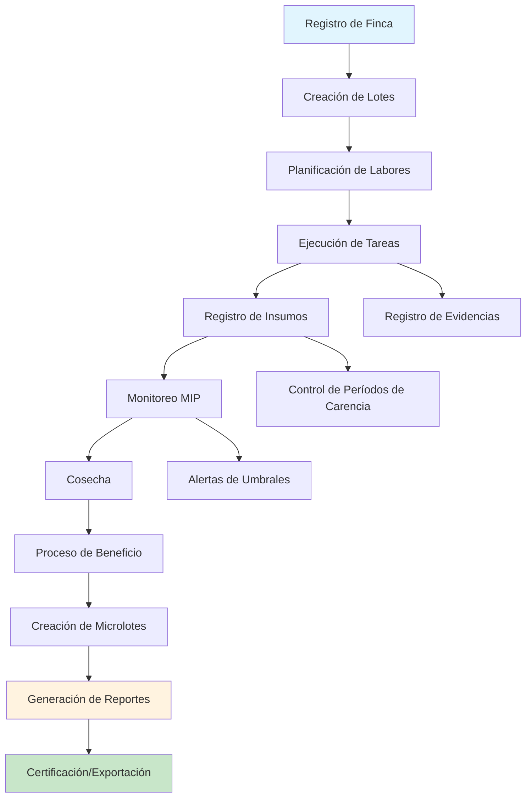

# Documento de Requisitos del Producto - CaféColombia App

## 1. Descripción General del Producto

CaféColombia App es una aplicación web integral para la gestión de fincas cafeteras que garantiza el cumplimiento de las Buenas Prácticas Agrícolas (BPA) y los estándares de la Federación Nacional de Cafeteros (FNC). La aplicación digitaliza todo el ciclo productivo del café, desde la siembra hasta la exportación, proporcionando trazabilidad completa y documentación para certificaciones internacionales.

- **Propósito principal**: Ser un asistente de cumplimiento normativo que permita a los caficultores colombianos acceder a mercados internacionales mediante la documentación adecuada de sus procesos productivos.
- **Usuarios objetivo**: Caficultores, administradores de finca, cooperativas cafeteras, exportadores y entidades certificadoras.
- **Valor de mercado**: Facilitar el acceso a mercados premium y certificaciones que pueden incrementar el precio del café hasta en un 30%.

## 2. Características Principales

### 2.1 Roles de Usuario

| Rol | Método de Registro | Permisos Principales |
|-----|-------------------|---------------------|
| Caficultor | Registro con cédula cafetera y validación SICA | Gestión completa de su finca, generación de reportes |
| Administrador de Finca | Invitación del caficultor propietario | Gestión operativa, registro de labores, control de personal |
| Trabajador de Campo | Registro por administrador con cédula | Registro de labores asignadas, consulta de tareas |
| Supervisor de Cooperativa | Registro institucional | Consulta de múltiples fincas, reportes consolidados |
| Auditor/Certificador | Acceso temporal autorizado | Solo lectura, generación de reportes de cumplimiento |

### 2.2 Módulos Funcionales

Nuestra aplicación de gestión cafetera consta de las siguientes páginas principales:

1. **Dashboard Principal**: panel de control con indicadores clave, alertas de cumplimiento BPA, estado de lotes y tareas pendientes.
2. **Gestión de Finca**: mapa interactivo con lotes georreferenciados, registro de variedades de café, historial inmutable de actividades.
3. **Planificación Agrícola**: calendario de labores, asignación de tareas al personal, alertas automáticas según edad del cultivo.
4. **Control de Insumos**: inventario de agroquímicos, registro obligatorio de aplicaciones, cálculo de períodos de carencia.
5. **Manejo Integrado de Plagas (MIP)**: monitoreo de broca y roya, registro de umbrales de acción, control de tratamientos.
6. **Cosecha y Beneficio**: registro de recolección, control del proceso post-cosecha, creación de microlotes trazables.
7. **Trazabilidad y Reportes**: generación de reportes BPA, certificados de trazabilidad, documentos para exportación.
8. **Gestión Financiera**: control de costos de producción, registro de personal, gestión de EPP y capacitaciones.
9. **Configuración y Perfil**: datos del caficultor, configuración de la finca, integración con SICA.

### 2.3 Detalles de Páginas

| Página | Módulo | Descripción de Funcionalidades |
|--------|--------|--------------------------------|
| Dashboard Principal | Panel de Control | Mostrar indicadores KPI de producción, alertas de cumplimiento BPA, estado de lotes por color, tareas vencidas y próximas |
| Dashboard Principal | Alertas Inteligentes | Generar notificaciones de períodos de carencia, alertas climáticas, recordatorios de renovación de cultivos |
| Gestión de Finca | Mapa Interactivo | Crear polígonos georreferenciados para cada lote, visualizar estado actual por colores, integrar con GPS móvil |
| Gestión de Finca | Registro de Lotes | Capturar variedad de café (Castillo, Caturra, etc.), fecha de siembra, densidad de siembra, estado del cultivo |
| Gestión de Finca | Historial Inmutable | Mantener log completo de actividades por lote, generar línea de tiempo visual, exportar historial para auditorías |
| Planificación Agrícola | Calendario de Labores | Crear tareas programadas según edad del cultivo, asignar personal específico, establecer fechas límite |
| Planificación Agrícola | Gestión de Tareas | Permitir registro de finalización por trabajadores, capturar fotos como evidencia, validar cumplimiento de procedimientos |
| Control de Insumos | Inventario Digital | Registrar compras con facturas digitales, controlar stock en tiempo real, alertar sobre productos próximos a vencer |
| Control de Insumos | Aplicación de Agroquímicos | Registrar obligatoriamente: producto, dosis, motivo, fecha, aplicador, calcular período de carencia automáticamente |
| Control de Insumos | Cumplimiento ICA | Validar productos contra lista aprobada ICA, generar alertas de productos no autorizados, mantener certificados de calidad |
| MIP | Monitoreo de Plagas | Registrar porcentajes de infestación de broca y roya, capturar fotos de síntomas, geolocalizar focos de infección |
| MIP | Umbrales de Acción | Configurar límites automáticos (ej: broca >2%), generar alertas de intervención, recomendar tipo de control |
| MIP | Control Integrado | Registrar controles culturales, biológicos y químicos, vincular con inventario de insumos, evaluar efectividad |
| Cosecha y Beneficio | Registro de Cosecha | Capturar kilos de cereza por lote y día, registrar calidad visual, asignar recolectores específicos |
| Cosecha y Beneficio | Proceso Post-cosecha | Controlar tiempos de despulpado, fermentación y lavado, medir humedad en secado, crear códigos QR por lote |
| Cosecha y Beneficio | Microlotes | Agrupar café por características especiales, generar certificados de origen, mantener trazabilidad completa |
| Trazabilidad y Reportes | Reportes BPA | Generar checklist de cumplimiento automático, exportar certificados PDF, preparar documentos para auditorías |
| Trazabilidad y Reportes | Certificados de Origen | Crear documentos con historia completa del café, incluir mapas de origen, generar códigos QR verificables |
| Trazabilidad y Reportes | Reportes de Sostenibilidad | Calcular huella de carbono, medir uso de agua, evaluar prácticas de conservación, generar métricas ambientales |
| Gestión Financiera | Control de Costos | Registrar gastos por categoría, calcular costo por kilo producido, generar análisis de rentabilidad por lote |
| Gestión Financiera | Gestión de Personal | Mantener registro de trabajadores, controlar pago de jornales, documentar entrega de EPP y capacitaciones |
| Configuración | Perfil del Caficultor | Gestionar datos personales y de la finca, configurar notificaciones, integrar con cédula cafetera SICA |
| Configuración | Sincronización | Configurar modo offline, gestionar sincronización de datos, exportar/importar información de respaldo |

## 3. Proceso Principal

### Flujo del Caficultor Propietario
El caficultor inicia registrando su finca y lotes en el mapa, luego planifica las labores según el calendario agrícola. Durante el ciclo productivo, registra todas las aplicaciones de insumos y monitoreos de plagas. En época de cosecha, documenta la recolección y el proceso de beneficio. Finalmente, genera los reportes de trazabilidad necesarios para la venta o exportación.

### Flujo del Trabajador de Campo
El trabajador consulta sus tareas asignadas en el calendario, ejecuta las labores registrando evidencias fotográficas, y marca como completadas las actividades. Para aplicaciones de agroquímicos, debe registrar obligatoriamente todos los datos requeridos por las BPA.

### Flujo del Auditor/Certificador
El auditor accede a los reportes de cumplimiento BPA, revisa la trazabilidad completa de los microlotes, y genera los certificados necesarios para las certificaciones internacionales.

## 4. Diseño de Interfaz de Usuario

### 4.1 Estilo de Diseño

- **Colores primarios**: Verde café (#2E7D32) y marrón tierra (#5D4037)
- **Colores secundarios**: Amarillo dorado (#FFA000) y verde claro (#81C784)
- **Estilo de botones**: Redondeados con sombras suaves, estilo material design
- **Tipografía**: Roboto para encabezados (18-24px), Open Sans para texto (14-16px)
- **Layout**: Diseño de tarjetas con navegación lateral fija, dashboard tipo grid
- **Iconografía**: Iconos de material design con temática agrícola, emojis de café ☕ y plantas 🌱

### 4.2 Descripción General de Páginas

| Página | Módulo | Elementos de UI |
|--------|--------|-----------------|
| Dashboard Principal | Panel de Control | Cards con KPIs coloridos, gráficos de barras para producción, mapa de calor para estado de lotes, lista de alertas con iconos |
| Gestión de Finca | Mapa Interactivo | Mapa de Google Maps con polígonos verdes/rojos según estado, toolbar flotante para herramientas de dibujo, panel lateral con detalles del lote |
| Planificación Agrícola | Calendario | Vista de calendario mensual con eventos coloridos, modal para crear tareas, filtros por tipo de labor y trabajador |
| Control de Insumos | Inventario | Tabla con indicadores de stock (verde/amarillo/rojo), formulario modal para registrar aplicaciones, scanner QR para productos |
| MIP | Monitoreo | Formulario con sliders para porcentajes de infestación, galería de fotos de síntomas, alertas rojas para umbrales superados |
| Cosecha y Beneficio | Registro | Formulario paso a paso con temporizadores, medidor visual de humedad, generador de códigos QR para microlotes |
| Trazabilidad | Reportes | Vista previa de PDFs, botones de descarga prominentes, timeline visual de la historia del café |
| Gestión Financiera | Control de Costos | Gráficos de torta para distribución de gastos, tabla de trabajadores con fotos, checklist visual para EPP |

### 4.3 Responsividad

La aplicación está diseñada con enfoque mobile-first, considerando que muchos caficultores usan principalmente dispositivos móviles en campo. Incluye optimización para interacciones táctiles como gestos de zoom en mapas, botones grandes para facilitar el uso con guantes, y funcionalidad offline completa para zonas con conectividad limitada.