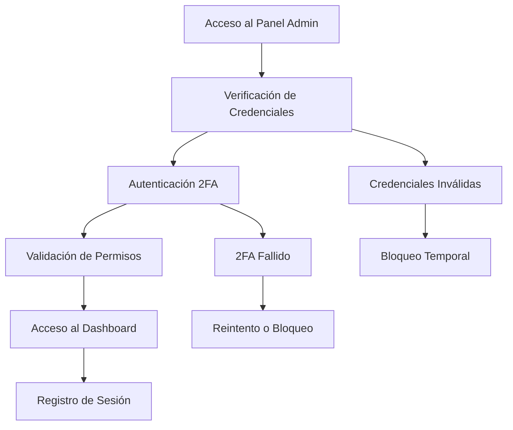
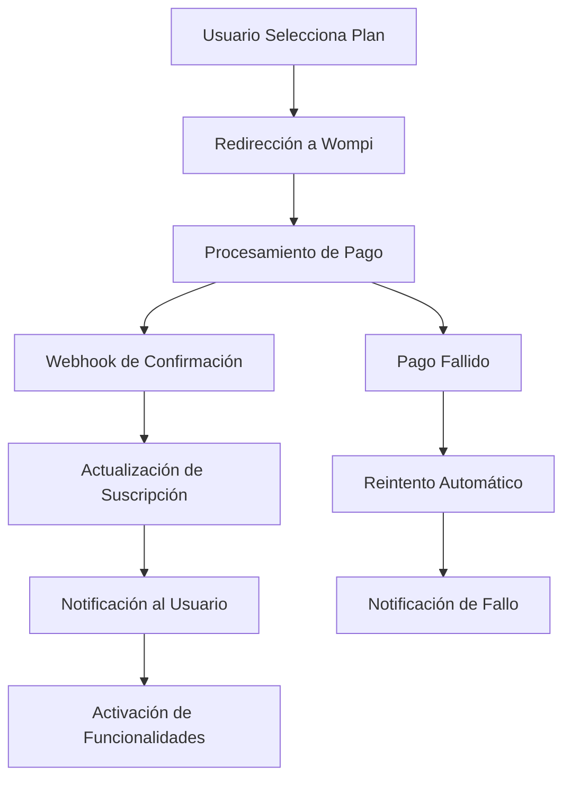
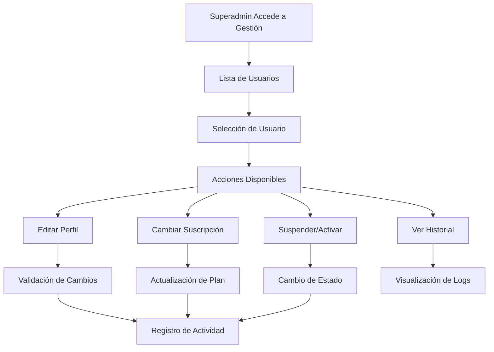

# Panel de Control del Superadministrador - Café Colombia
## Documento de Requisitos del Producto (PRD)

## 1. Resumen Ejecutivo

El Panel de Control del Superadministrador es una extensión crítica de la aplicación Café Colombia que proporciona capacidades administrativas avanzadas y un sistema de suscripciones robusto. Este sistema permitirá la gestión completa de usuarios, caficultores, fincas y métricas de la aplicación, junto con un sistema de pagos integrado con Wompi para manejar suscripciones mensuales y anuales.

**Objetivos principales:**
- Centralizar la administración de todos los aspectos de la aplicación
- Implementar un modelo de negocio sostenible a través de suscripciones
- Garantizar la seguridad y trazabilidad de todas las operaciones administrativas
- Mantener la funcionalidad existente de la aplicación sin interrupciones

## 2. Roles de Usuario

| Rol | Método de Registro | Permisos Principales |
|-----|-------------------|---------------------|
| Superadministrador | Acceso directo con credenciales maestras + 2FA | Control total del sistema, gestión de usuarios, configuración de planes, acceso a métricas |
| Administrador | Invitación del superadmin | Gestión limitada de usuarios y contenido, sin acceso a configuración de pagos |
| Caficultor Premium | Suscripción pagada | Acceso completo a todas las funcionalidades de la app |
| Caficultor Básico | Registro gratuito | Acceso limitado a funcionalidades básicas |

## 3. Características Principales

### 3.1 Módulos del Sistema

**Panel de Control del Superadministrador:**

1. **Dashboard Principal**: Métricas clave, resumen de actividad, alertas del sistema
2. **Gestión de Usuarios**: Administración completa de todos los usuarios del sistema
3. **Gestión de Caficultores**: Control específico de perfiles de caficultores y sus datos
4. **Gestión de Fincas**: Administración de fincas asociadas y sus características
5. **Sistema de Suscripciones**: Configuración y gestión de planes de pago
6. **Procesamiento de Pagos**: Integración con Wompi y gestión de transacciones
7. **Reportes y Analíticas**: Generación de reportes detallados y métricas de negocio
8. **Configuración del Sistema**: Parámetros globales y configuraciones avanzadas
9. **Registro de Actividades**: Auditoría completa de acciones administrativas
10. **Gestión de Seguridad**: Control de accesos y permisos del sistema

### 3.2 Detalles de Páginas y Funcionalidades

| Página | Módulo | Descripción de Funcionalidades |
|--------|--------|-------------------------------|
| Dashboard Principal | Métricas Generales | Visualización de KPIs clave: usuarios activos, ingresos, suscripciones activas, alertas del sistema. Gráficos interactivos de tendencias |
| Gestión de Usuarios | Administración de Usuarios | CRUD completo de usuarios, filtros avanzados, exportación de datos, suspensión/activación de cuentas, historial de actividad |
| Gestión de Caficultores | Administración de Caficultores | Perfil detallado de caficultores, gestión de fincas asociadas, historial de suscripciones, métricas de uso de la app |
| Gestión de Fincas | Administración de Fincas | Visualización en mapa, edición de datos de fincas, asociación con caficultores, métricas de producción |
| Planes de Suscripción | Sistema de Pagos | Configuración de planes (precios, características), activación/desactivación, promociones y descuentos |
| Historial de Pagos | Sistema de Pagos | Visualización de transacciones, estados de pago, reembolsos, reportes financieros, integración con Wompi |
| Reportes y Analíticas | Reportes | Generación de reportes personalizados, exportación en múltiples formatos, programación de reportes automáticos |
| Configuración del Sistema | Administración | Parámetros globales, configuración de notificaciones, mantenimiento del sistema, respaldos |
| Registro de Actividades | Auditoría | Log completo de acciones administrativas, filtros por usuario/fecha/acción, exportación de logs |
| Gestión de Seguridad | Seguridad | Configuración de políticas de seguridad, gestión de roles y permisos, configuración 2FA |

## 4. Flujo Principal de Procesos

### 4.1 Flujo de Autenticación del Superadministrador

### 4.2 Flujo de Procesamiento de Pagos

### 4.3 Flujo de Gestión de Usuarios

## 5. Diseño de Interfaz de Usuario

### 5.1 Estilo de Diseño

**Colores Principales:**
- Primario: #1E40AF (Azul Administrativo)
- Secundario: #059669 (Verde Café)
- Acento: #DC2626 (Rojo para Alertas)
- Neutro: #6B7280 (Gris para Texto)

**Estilo de Botones:**
- Botones principales: Redondeados con sombra sutil
- Botones secundarios: Outline con hover effect
- Botones de acción crítica: Rojo con confirmación modal

**Tipografía:**
- Encabezados: Inter Bold, 24px-32px
- Texto principal: Inter Regular, 14px-16px
- Texto secundario: Inter Light, 12px-14px

**Layout:**
- Sidebar fijo con navegación principal
- Header con información de usuario y notificaciones
- Contenido principal con cards y tablas responsivas
- Modales para acciones críticas

### 5.2 Diseño de Páginas Principales

| Página | Módulo | Elementos de UI |
|--------|--------|-----------------|
| Dashboard Principal | Métricas | Cards con KPIs, gráficos interactivos (Chart.js), tabla de actividad reciente, alertas destacadas |
| Gestión de Usuarios | Administración | Tabla con paginación, filtros avanzados, modales de edición, botones de acción en lote |
| Gestión de Pagos | Sistema de Pagos | Timeline de transacciones, gráficos de ingresos, tabla de suscripciones, indicadores de estado |
| Configuración | Administración | Formularios organizados en tabs, toggles para configuraciones, botones de guardado prominentes |

### 5.3 Responsividad

**Desktop-first con adaptación móvil:**
- Breakpoints: 1200px (desktop), 768px (tablet), 480px (móvil)
- Sidebar colapsable en dispositivos móviles
- Tablas con scroll horizontal en pantallas pequeñas
- Modales adaptados para touch interaction

## 6. Requisitos de Seguridad

### 6.1 Autenticación y Autorización

- **Autenticación Multi-Factor (2FA)** obligatoria para superadministradores
- **Tokens JWT** con expiración corta (15 minutos) y refresh tokens
- **Roles y permisos granulares** con validación en frontend y backend
- **Sesiones seguras** con logout automático por inactividad

### 6.2 Protección de Datos

- **Encriptación AES-256** para datos sensibles en base de datos
- **HTTPS obligatorio** para todas las comunicaciones
- **Sanitización de inputs** para prevenir inyecciones
- **Rate limiting** para prevenir ataques de fuerza bruta

### 6.3 Auditoría y Monitoreo

- **Registro completo de actividades** con timestamp y detalles de acción
- **Alertas automáticas** para actividades sospechosas
- **Respaldos automáticos** de logs de auditoría
- **Monitoreo en tiempo real** de accesos administrativos

## 7. Sistema de Suscripciones y Pagos

### 7.1 Planes de Suscripción

| Plan | Precio Mensual | Precio Anual | Características |
|------|---------------|--------------|-----------------|
| Básico | Gratuito | Gratuito | Funcionalidades limitadas, máximo 1 finca |
| Premium | $29.900 COP | $299.000 COP | Acceso completo, fincas ilimitadas, IA avanzada |
| Empresarial | $59.900 COP | $599.000 COP | Multi-usuario, reportes avanzados, soporte prioritario |

### 7.2 Integración con Wompi

- **Procesamiento seguro** de tarjetas de crédito y débito
- **Webhooks** para confirmación automática de pagos
- **Manejo de fallos** con reintentos automáticos
- **Reembolsos** procesados a través de la plataforma
- **Reportes financieros** integrados con el dashboard

### 7.3 Gestión de Suscripciones

- **Activación automática** tras confirmación de pago
- **Renovación automática** con notificaciones previas
- **Degradación gradual** por falta de pago
- **Cancelación** con período de gracia
- **Cambios de plan** con prorrateo automático

## 8. Métricas y KPIs

### 8.1 Métricas de Negocio

- **Ingresos Recurrentes Mensuales (MRR)**
- **Valor de Vida del Cliente (LTV)**
- **Tasa de Churn** mensual y anual
- **Costo de Adquisición de Cliente (CAC)**
- **Conversión de freemium a premium**

### 8.2 Métricas de Producto

- **Usuarios Activos Diarios/Mensuales (DAU/MAU)**
- **Tiempo de sesión promedio**
- **Funcionalidades más utilizadas**
- **Tasa de retención** por cohortes
- **Net Promoter Score (NPS)**

### 8.3 Métricas Operacionales

- **Tiempo de respuesta** de la aplicación
- **Disponibilidad del sistema** (uptime)
- **Errores por minuto**
- **Uso de recursos** del servidor
- **Tiempo de resolución** de incidentes

## 9. Requisitos Técnicos

### 9.1 Compatibilidad

- **Navegadores soportados:** Chrome 90+, Firefox 88+, Safari 14+, Edge 90+
- **Dispositivos:** Desktop, tablet, móvil
- **Resoluciones:** Desde 320px hasta 4K
- **Accesibilidad:** Cumplimiento WCAG 2.1 AA

### 9.2 Performance

- **Tiempo de carga inicial:** < 3 segundos
- **Tiempo de respuesta API:** < 500ms
- **Disponibilidad:** 99.9% uptime
- **Escalabilidad:** Soporte para 10,000+ usuarios concurrentes

### 9.3 Integración

- **Mantener compatibilidad** completa con la aplicación existente
- **APIs RESTful** para todas las operaciones
- **Webhooks** para eventos críticos
- **Exportación de datos** en formatos estándar (CSV, JSON, PDF)

## 10. Plan de Implementación

### 10.1 Fases de Desarrollo

**Fase 1 - Fundación (4 semanas):**
- Autenticación y autorización
- Dashboard básico con métricas principales
- Gestión básica de usuarios

**Fase 2 - Gestión Avanzada (3 semanas):**
- Gestión completa de caficultores y fincas
- Sistema de roles y permisos
- Registro de actividades

**Fase 3 - Sistema de Pagos (4 semanas):**
- Integración con Wompi
- Gestión de suscripciones
- Procesamiento de pagos y webhooks

**Fase 4 - Analíticas y Reportes (2 semanas):**
- Dashboard de métricas avanzadas
- Generación de reportes
- Exportación de datos

**Fase 5 - Optimización y Testing (2 semanas):**
- Pruebas de seguridad
- Optimización de performance
- Testing de integración

### 10.2 Criterios de Aceptación

- **Funcionalidad:** Todas las características implementadas según especificaciones
- **Seguridad:** Auditoría de seguridad aprobada
- **Performance:** Métricas de performance cumplidas
- **Usabilidad:** Testing de usuario completado satisfactoriamente
- **Integración:** Compatibilidad con aplicación existente verificada